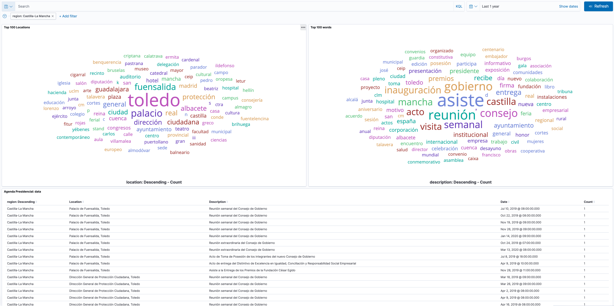

# Cansino
Sometimes politicians talk a lot about what they say it's important for the citizens, and many times we don't find them not doing what they say.

In this direction, we want to get the public agendas of certain politicians, scrap them (as they don't offer a public API to read them), and store the events of each day in a repository. Therefore we will be able to query those events in a structured manner using Big Data techniques, and check if what they do (their agendas) are aligned with what they promise.

We process each event, removing Spanish stop words, and index into `Elasticsearch`, displaying tag clouds with the most frequent words they use in a `Kibana` dashboard.

>As you can see in the above screenshot many politicians simply "attends" to meetings. Well, this is something we know. But as a citizen, I'd like them to be more transparent about what they are on.

## The stack
Cansino is a program written in Go, processing each agenda's events and sending them to [Elastic Cloud](https://cloud.elastic.co). To configure the connection to Elastic Cloud, please rename the `sample.env` file into `.env`, including your own values.

The Go code is instrumented with [Elastic's APM Go Agent](https://www.elastic.co/guide/en/apm/agent/go/master/index.html), creating traces each time a document is indexed.

The execution flow is defined by a CLI, written with [Cobra](https://github.com/spf13/cobra), having two main commands:

- `chase`, which will process all events in all the agendas
- `get [-d|--date 2020-04-14]`, which will process all events in all agendas in a specific day. If the date is equals to the string "Today", then it will use _Now()_.
- `get [-r|--region "Madrid"]`, which will process all events in all agendas for an specific region. If the region is not supported by the tool (_see bellow_), the program will abort. If the region is equals to `"all"`, then all supported regions will be processed.

The Elasticsearch index is defined in the `index.json` file, which includes fields and the Spanish and Stop words analyzers, which are used to keep only the words of interest.

The scrapping process is done using [Go-Colly](http://go-colly.org/), but sometimes I had to use [htmlquery](https://github.com/antchfx/htmlquery) to parse the HTML returned by Ajax requests.

> As a side note, it's frustrating to see how Madrid region is using POST to view each day's events :man_facepalming:

The initial process to index all documents was done in my computer, and I added a Github Action to index the events of the current day, in a cron-like manner.

## Regions indexed
These are the regions indexed by Cansino.

- Spain
    - Castilla-La Mancha (my region!)
    - Extremadura
    - Madrid

## Access to the dashboards
Would you like to access a dashboard? Send me an email to `mdelapenya at gmail.com`.

## Want to add a region?
Please [open an issue!](https://github.com/mdelapenya/cansino/issues/new)
